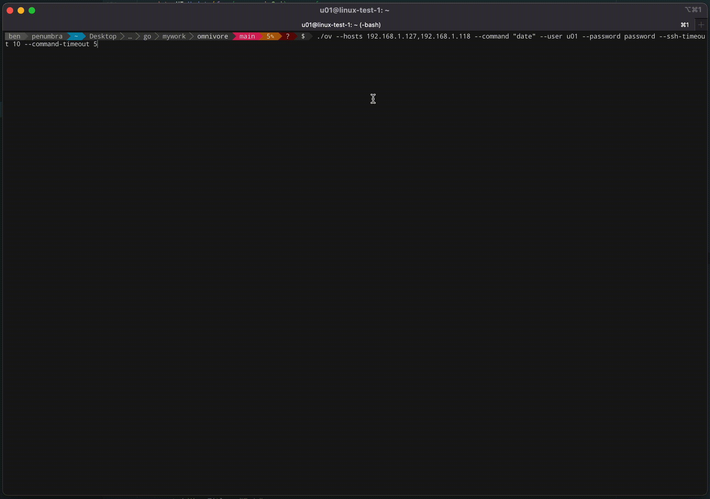
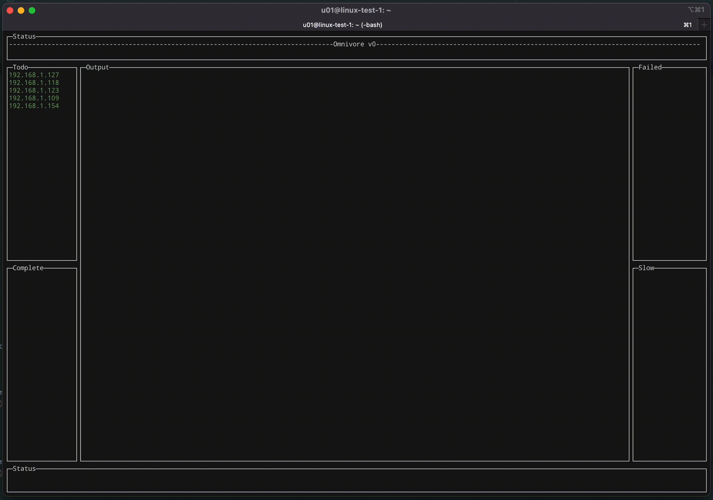

NOTE: Currently in development...

Logo designed by dgim-studio

Omnivore is an interactive distributed SSH tool. Designed to quickly identify output anomalies and inconsistencies in large environments.

This program was developed alongside https://github.com/discoriver/massh, and is tightly integrated with it. It's my hope that Omnivore not only serves as a useful tool, but also as a demonstration of how one might utilise Massh elegantly to provide powerful programs that require advanced SSH output processing.

## Upcoming features
- Generally more interactive ability from within the program itself. Running new commands on the same host set, changing public key used, viewing output for individual hosts in their own views etc.
- Ability for scripts to be executed.
- Ability to retry failed hosts a configurable number of times.
- Better SSH key handling.

## Demos

### Demo 1 - Small number of hosts, grouped output

### Demo 2 - Larger number of hosts, some failing, no grouping.

## Known Issues

- If using iTerm2 on MacOS, you will need to edit your profile, and under the `Terminal` heading, uncheck the option `Save lines to scrollback in alternate screen mode`. Leaving this option checked will cause major trauma to your scroll buffer when resizing the terminal window when Omnivore is running.
- Output does not maintain order.

## Acknowledgements

- Dee, for enriching my life for a time.
- Tim for putting his trust in me to do good work.
- Adam & Bryan for helping me see the value.
- Alysha for always propping up my ego.

